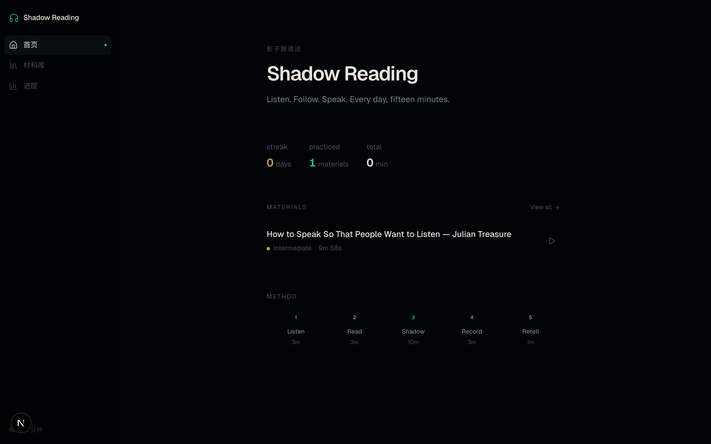
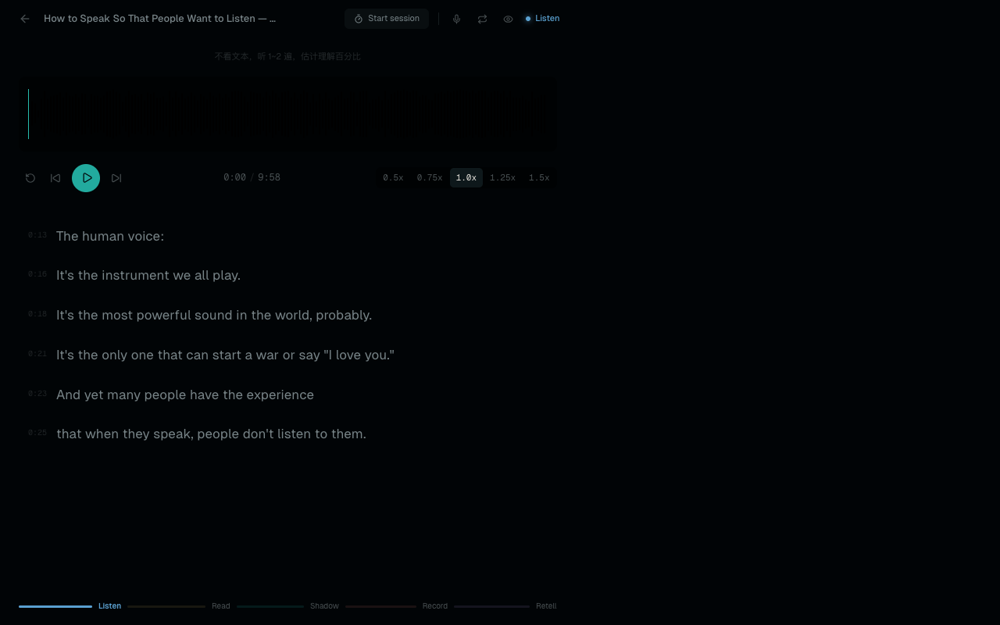
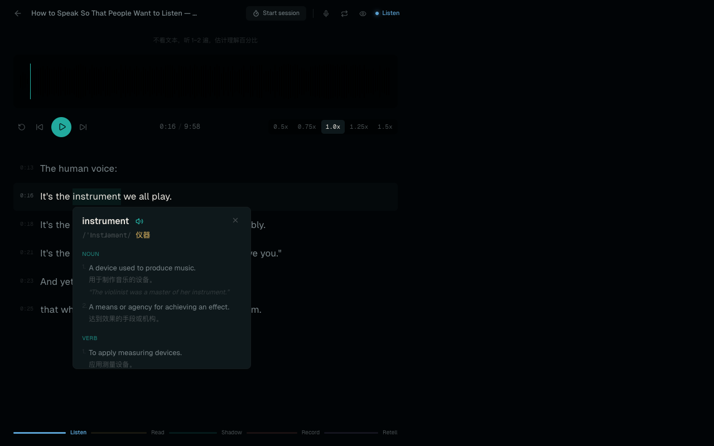

<div align="center">

# Shadow Reading

**Una herramienta personal de entrenamiento diario de inglés para escuchar, leer, hacer shadowing, grabar y parafrasear.**

Importa materiales en inglés y sigue un flujo ligero de unos 20 minutos: primero comprende al escuchar, luego comprende al leer, después practica el shadowing y, finalmente, graba y parafrasea.

[](https://nextjs.org/)
[](https://react.dev/)
[](https://www.typescriptlang.org/)
[](https://tailwindcss.com/)
[](LICENSE)

</div>

---



## Qué hace

Shadow Reading se basa en un ciclo diario repetible:

```text
Escuchar -> Leer -> Shadowing -> Grabar -> Parafrasear
```

La aplicación asigna un enfoque claro a cada fase, pero los cambios de fase son manuales. Los temporizadores pueden sugerir que es momento de avanzar, mientras que el usuario mantiene el control de cuándo hacerlo.

## Flujo de Trabajo Principal

1. Importar o crear un material.
2. Confirmar las unidades de frases y las traducciones al chino opcionales.
3. Practicar a través de las cinco fases.
4. Repetir las frases difíciles con un pequeño margen de entrada y salida (buffer).
5. Grabarse a uno mismo y parafrasear el material de memoria.



## Características

- **Flujo de práctica de cinco fases**: escucha a ciegas, lectura detallada, shadowing, grabación y parafraseo.
- **Progresión manual de fases**: el audio/video actual se reinicia en los límites de fase para que cada etapa comience limpiamente.
- **Importación de texto a material**: pega texto en inglés, verifica la gramática, reescríbelo de forma natural, genera voz por IA y practícalo inmediatamente.
- **Vistas previas de voz**: cada voz de IA tiene una breve vista previa incluida en `public/voice-previews`.
- **Duplicación de materiales**: copia un material existente como un nuevo elemento de práctica, incluyendo subtítulos, traducciones y marcas de pronunciación.
- **Exportación de materiales**: exporta un paquete `.shadow-reading.json` con metadatos, subtítulos, traducciones, marcas y medios locales, o una transcripción simple en `.txt`.
- **Unidades de frases editables**: la división automática de frases utiliza `sentence-splitter`, y luego permite editar, dividir y fusionar filas antes de guardar.
- **Traducciones al chino**: genera traducciones al chino por frase durante la importación de texto y muestra líneas bilingües durante la lectura.
- **Importación de audio y video**: carga archivos de audio/video locales con subtítulos opcionales en formato SRT, VTT, TXT o JSON.
- **Importación de YouTube**: pega una URL de YouTube para descargar el audio y los subtítulos en inglés a través de `yt-dlp`.
- **Bucle de frases con buffer**: repite la frase actual con límites de inicio/fin ajustados en lugar de cortes demasiado precisos.
- **Diccionario bilingüe**: haz doble clic en una palabra para ver definiciones en inglés, traducción al chino y filas de pronunciación US/UK.
- **Materiales locales primero**: los materiales importados y generados se almacenan localmente en `data/materials`.
- **Práctica orientada al teclado**: la reproducción, el bucle, la visibilidad de los subtítulos, la grabación y los controles de velocidad están disponibles desde el teclado.



## Atajos de Teclado

| Tecla | Acción |
|:---:|--------|
| <kbd>Space</kbd> | Reproducir / Pausar |
| <kbd>R</kbd> | Iniciar / Detener grabación |
| <kbd>L</kbd> | Alternar bucle de frase |
| <kbd>S</kbd> | Alternar visibilidad de subtítulos |
| <kbd>← →</kbd> | Saltar atrás / adelante 5s |
| <kbd>↑ ↓</kbd> | Aumentar / disminuir velocidad |

## Primeros Pasos

**Requisitos previos:** Node.js 20+, pnpm. Para la importación de YouTube, instala `yt-dlp` y `ffmpeg`.

```bash
git clone https://github.com/674019130/shadow-reading.git
cd shadow-reading
pnpm install
pnpm dev
```

Abre `http://localhost:3000`. Para usar otro puerto:

```bash
PORT=3100 pnpm dev
```

Se incluye una charla de TED como material de inicio. Los nuevos materiales pueden provenir de texto pegado, archivos de audio/video locales o YouTube.

## Variables de Entorno

OpenAI solo es necesario para la revisión de texto por IA y la generación de voz por IA. El resto de la aplicación puede funcionar sin ello.

| Variable | Requerido | Propósito |
|----------|----------|---------|
| `OPENAI_API_KEY` | Para revisión de texto y voz | Habilita la verificación, reescritura de texto pegado y generación de TTS |
| `OPENAI_TEXT_MODEL` | No | Sobrescribe el modelo de revisión de texto, por defecto `gpt-4.1-mini` |
| `OPENAI_TTS_MODEL` | No | Sobrescribe el modelo de voz, por defecto `gpt-4o-mini-tts` |
| `LIBRETRANSLATE_URL` | No | Endpoint preferido de LibreTranslate para traducción al chino |
| `LIBRETRANSLATE_URLS` | No | Endpoints de LibreTranslate separados por comas para intentar |
| `LIBRETRANSLATE_API_KEY` | No | Clave API para endpoints compatibles con LibreTranslate |

La traducción al chino utiliza proveedores gratuitos oportunamente, actualmente MyMemory y endpoints compatibles con LibreTranslate. La disponibilidad y la calidad de la traducción pueden variar.

## Almacenamiento de Materiales

```text
data/
├── materials/
│   ├── index.json        # índice local de materiales
│   └── *.mp3 / *.mp4    # medios cargados o generados
└── youtube-cache/        # descargas de YouTube en caché

public/
├── starter-materials/    # audio y subtítulos de inicio integrados
└── voice-previews/       # clips de vista previa de voces de IA integrados
```

Los materiales de texto generados guardan el habla de la IA como medios locales y almacenan los tiempos de subtítulos estimados a partir de las filas de frases confirmadas.

## Verificación

```bash
pnpm lint
node --experimental-strip-types --test \
  tests/server-materials.test.mts \
  tests/text-material.test.mts \
  tests/practice-store.test.mts \
  tests/loop-range.test.mts
pnpm build
```

## Stack Tecnológico

| Categoría | Tecnología |
|----------|------------|
| Framework | Next.js 16, React 19, TypeScript |
| Estilos | Tailwind CSS 4 |
| Audio | wavesurfer.js |
| Video | Video nativo de HTML |
| Grabación | Web MediaRecorder API |
| DB Local | Dexie.js e índice local de materiales en JSON |
| Estado | Zustand |
| Gráficos | Recharts |
| División de frases | sentence-splitter |
| Diccionario | Free Dictionary API + MyMemory |
| Texto y voz IA | OpenAI Responses API + Audio Speech API |
| Importación | Carga local, YouTube a través de yt-dlp y ffmpeg |

## Notas

- La sincronización de los subtítulos de la voz generada se estima según la longitud de las frases confirmadas, no mediante alineación forzada a nivel de palabra.
- La traducción gratuita debe tratarse como un borrador. La pantalla de importación de texto permite la corrección manual antes de guardar.
- Los medios cargados localmente se sirven con solicitudes de rango (range requests) para que el desplazamiento de audio y video funcione en la página de práctica.

## Licencia

MIT
