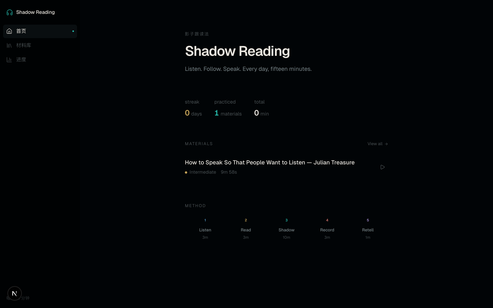
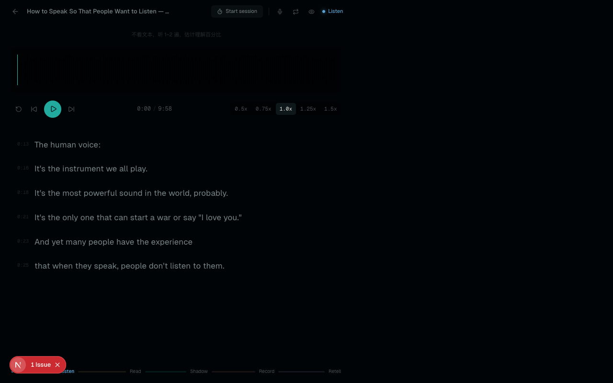
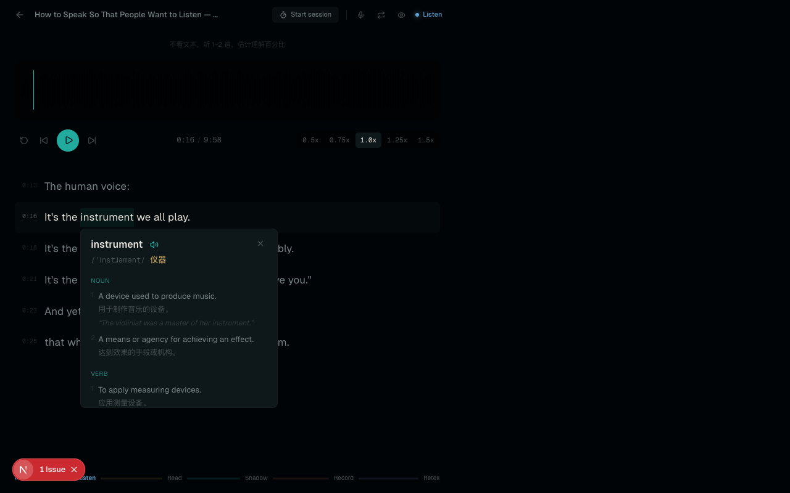

# Shadow Reading

An immersive English speaking practice tool built on the **shadow reading method** (影子跟读法). Listen to native speakers, follow along like a shadow, and build fluency through daily guided sessions.



## Practice Mode

Full-screen immersive interface with waveform audio player, synchronized subtitles, and a 5-phase guided session flow.



## Double-click Dictionary

Double-click any word in the subtitles to instantly look up its definition — bilingual English/Chinese with pronunciation, part of speech, and examples.



## Features

- **Waveform Audio Player** — wavesurfer.js with speed control (0.5x - 1.5x), skip, and restart
- **Synchronized Subtitles** — SRT/VTT/JSON parsing with binary search time sync and auto-scroll
- **5-Phase Guided Practice** — Blind Listen (3m) → Read (3m) → Shadow (10m) → Record (3m) → Retell (1m)
- **Sentence Loop** — Click any subtitle to seek; press `L` to loop the current sentence
- **Voice Recording** — Record yourself and compare side-by-side with the original audio
- **Bilingual Dictionary** — Double-click any word for instant EN/CN definition lookup
- **YouTube Import** — Paste a YouTube URL to auto-download audio + English subtitles via yt-dlp
- **Local File Import** — Drag and drop MP3 + SRT file pairs
- **Progress Tracking** — Practice streak calendar, comprehension trends, session history
- **Session Assessment** — Rate your performance after each session with comprehension %, sync loss count, and notes
- **Keyboard-First** — Full keyboard shortcut support for distraction-free practice

## Keyboard Shortcuts

| Key | Action |
|-----|--------|
| `Space` | Play / Pause |
| `R` | Start / Stop recording |
| `L` | Toggle sentence loop |
| `S` | Toggle subtitle visibility |
| `← / →` | Skip back / forward 5s |
| `↑ / ↓` | Speed up / down |

## Getting Started

**Prerequisites:** Node.js 20+, pnpm, yt-dlp (for YouTube import), ffmpeg

```bash
# Clone
git clone https://github.com/674019130/shadow-reading.git
cd shadow-reading

# Install
pnpm install

# Run
pnpm dev
# → http://localhost:3000
```

A built-in TED Talk (Julian Treasure — "How to Speak So That People Want to Listen") is included as starter material. Import more via YouTube URL or local files.

## Tech Stack

- **Framework:** Next.js 16 + React 19 + TypeScript
- **Styling:** Tailwind CSS 4 with OKLCH color system
- **Audio:** wavesurfer.js (waveform rendering + playback)
- **Recording:** Web MediaRecorder API
- **Storage:** Dexie.js (IndexedDB) for metadata, filesystem for audio files
- **State:** Zustand (practice session state)
- **Charts:** Recharts (progress dashboard)
- **Dictionary:** [Free Dictionary API](https://dictionaryapi.dev) + [MyMemory Translation API](https://mymemory.translated.net)
- **Import:** yt-dlp (YouTube audio + subtitle extraction)

## Project Structure

```
src/
├── app/                      # Next.js pages + API routes
│   ├── page.tsx              # Home dashboard
│   ├── practice/[id]/        # Practice mode
│   ├── materials/            # Material library
│   ├── progress/             # Progress dashboard
│   └── api/                  # Upload, serve, YouTube, screenshot
├── components/
│   ├── practice/             # AudioPlayer, SubtitleDisplay, RecordingPanel,
│   │                         # SessionTimer, DictionaryPopup, AssessmentDialog
│   ├── materials/            # MaterialsLibrary, ImportDialog
│   ├── progress/             # ProgressDashboard (streak, charts, history)
│   └── layout/               # AppShell, Sidebar
├── stores/                   # Zustand practice session store
└── lib/                      # DB, SRT parser, recorder, types
```

## License

MIT
